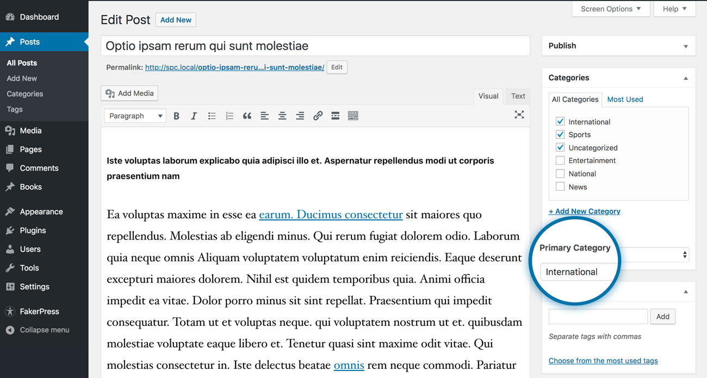

<h1 align="center"> 🎲 Simple Primary Category</h1>

A light-weight WordPress plugin to assign & query posts and custom post types based on their primary taxonomy.

## 💾 Installation

1. Download the plugin
2. Login to your WordPress website dashboard
3. Navigate to Dashboard > Plugins
4. Click Add New and then Upload Plugin
5. Browse to the file, select it and click Install Now
6. Click Activate Plugin once prompted.

## ✅ How to Use

1. Browse to any post or custom post type in WordPress admin.
2. Check the taxonomies that you want to assign to it.
3. Select the respective primary taxonomies.
4. Save the post.
5. Use this shortcode to query the posts: `spc_primary_term_posts`.
6. Use the action hook — `spc_display_primary_term_posts` — to display the queried posts in your theme.

### 🏁 Accepted Shortcode Arguments

| Argument         | Description                          | Default   |
| ---------------- | ------------------------------------ | --------- |
| `term`           | Term ID or name.                     | —        |
| `taxonomy`       | (Optional) Taxonomy name.            | `null`    |
| `post_type`      | (Optional) Custom Post Type.         | `post`    |
| `post_status`    | (Optional) Post status.              | `publish` |
| `posts_per_page` | (Optional) Number of posts per page. | `10`      |

## 🖥️ Screenshot

## ©️ License & Attribution
GPL2+ © [Ashar Irfan](https://asharirfan.com).
